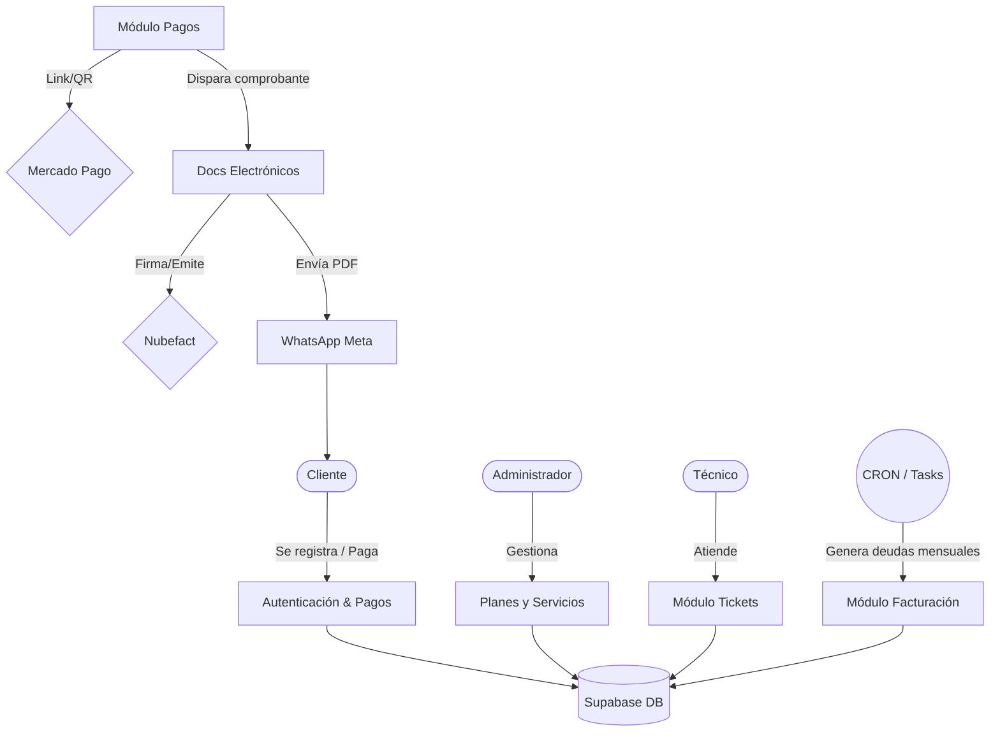

# AERONET Backend (API)

Backend del proyecto **AERONET** — API REST construida con **NestJS** para el sistema de gestión de AeroNet (clientes, servicios, facturación, pagos y comprobantes electrónicos).

---

## Índice

- [Requisitos](#requisitos)
- [Instalación y ejecución](#instalación-y-ejecución)
- [Estructura del proyecto](#estructura-del-proyecto)
- [Módulos de negocio](#módulos-de-negocio)
- [Integraciones externas](#integraciones-externas)
- [API y documentación Swagger](#api-y-documentación-swagger)
- [Variables de entorno](#variables-de-entorno)
- [Tareas programadas (CRON)](#tareas-programadas-cron)
- [Tests](#tests)

---

## Requisitos

- **Node.js** (v18 o superior recomendado)
- **npm** o **yarn**
- Cuenta **Supabase** (base de datos PostgreSQL, esquema `aeronet`)
- Opcional: **ngrok** para exponer webhooks (Mercado Pago)

---

## Instalación y ejecución

```bash
# Desde la raíz del monorepo o desde apps/backend
cd apps/backend
npm install
```

```bash
# Desarrollo (watch mode)
npm run start:dev

# Producción
npm run build
npm run start:prod

# Debug
npm run start:debug
```

Por defecto el servidor escucha en **puerto 3000** y en `0.0.0.0` para permitir acceso desde Docker/ngrok.

### Inicialización de Base de Datos
Para configurar las tablas de la base de datos en Supabase:
1. Abre el **SQL Editor** en tu panel de Supabase.
2. Copia y pega el contenido del archivo `database_schema.db` que te hemos proporcionado.
3. Haz clic en **Run**. Este script creará automáticamente el esquema `aeronet` y todas las tablas necesarias (clientes, facturas, tickets, etc.).

---

## Estructura del proyecto

```
apps/backend/
├── src/
│   ├── main.ts                 # Punto de entrada: bootstrap, CORS, Swagger, validación global
│   ├── app.module.ts           # Módulo raíz: importa todos los módulos y configuraciones
│   ├── app.controller.ts       # Rutas de salud: /health, /test-db
│   ├── app.service.ts          # Prueba de conexión a Supabase
│   ├── supabase.service.ts     # Cliente Supabase (esquema aeronet)
│   ├── supabase.module.ts
│   │
│   ├── common/                 # Recursos compartidos
│   │   ├── guards/             # JwtAuthGuard, RolesGuard
│   │   └── decorators/         # @Roles
│   │
│   ├── modules/                # Módulos de negocio
│   │   ├── auth/               # Login, registro, JWT, signup cliente
│   │   ├── customers/          # CRUD clientes, perfil, avatar
│   │   ├── plans/              # Catálogo de planes
│   │   ├── services/           # Instalaciones/servicios
│   │   ├── invoices/           # Facturas/deudas, generación mensual, facturación diaria
│   │   ├── payments/           # Pagos, Mercado Pago, webhooks
│   │   ├── electronic-documents/  # Comprobantes SUNAT (Nubefact), reenvío WhatsApp
│   │   ├── tasks/              # CRON: facturación, notificaciones
│   │   ├── technician/         # CRUD técnicos
│   │   └── tickets/            # Tickets y órdenes de trabajo
│   │
│   └── integrations/          # Servicios externos
│       ├── mercadopago/        # QR dinámico, webhook merchant_order/payment
│       ├── nubefact/           # Boleta/factura electrónica (SUNAT)
│       ├── notifications/      # WhatsApp (Meta), plantillas, recordatorios

├── test/                       # Tests e2e
├── package.json
└── README.md                   # Este archivo
```

---

## Arquitectura y Flujo de Datos

A continuación se ilustra el flujo general del sistema backend interactuando con los usuarios y servicios externos:



---

## Módulos de negocio

| Módulo | Ruta base | Descripción |
|--------|-----------|-------------|
| **Auth** | `/auth` | Login, registro admin/técnico, signup cliente (JWT). |
| **Customers** | `/customers` | CRUD clientes, perfil (`/me`), subida de avatar. |
| **Plans** | `/plans` | CRUD planes de internet. |
| **Services** | `/services` | Instalaciones/servicios, creación con ticket. |
| **Invoices** | `/invoices` | Deudas/facturas, generación mensual, facturación diaria, “mis deudas”. |
| **Payments** | `/payments` | Generar link/QR (Mercado Pago), webhooks, CRUD pagos, recordatorio WhatsApp. |
| **Electronic Documents** | `/electronic-documents` | Comprobantes Nubefact, reenvío por WhatsApp. |
| **Tickets** | `/tickets` | Tickets y órdenes de trabajo (work_order / ticket). |
| **Technician** | `/technician` | CRUD técnicos, perfil (`/me`). |

La mayoría de rutas están protegidas con **JwtAuthGuard** y **RolesGuard**; los webhooks de pago (Mercado Pago) son públicos.

---

## Integraciones externas

- **Supabase**: Base de datos (PostgreSQL, esquema `aeronet`) y Auth.
- **Mercado Pago**: QR dinámico, preferencias/checkout, webhook `merchant_order` and `payment`.
- **Nubefact**: Emisión de boletas y facturas electrónicas (SUNAT).
- **WhatsApp (Meta)**: Notificaciones por plantillas (recordatorios, alerta de pago, comprobante).


---

## API y documentación Swagger

- **Documentación interactiva**: con el servidor en marcha, abre en el navegador:
  - `http://localhost:3000/api`
- Incluye **Bearer JWT** para probar rutas protegidas.
- Títulos de grupos (tags): Auth, Customers, Plans, Services, Invoices, Payments, Electronic Documents, Tickets, Technicians, Notifications.

---

## Variables de entorno

Configuración típica en `.env` en la raíz del monorepo o en `apps/backend`. No incluyas secretos en el README; aquí solo se listan nombres de referencia.

| Variable | Uso |
|----------|-----|
| `PORT` | Puerto del servidor (default 3000). |
| `CORS_ORIGINS` | Orígenes permitidos (separados por coma). |
| `BACKEND_URL` | URL pública del backend (ej. ngrok). |
| `FRONTEND_URL` | URL del frontend cliente. |
| `SUPABASE_URL`, `SUPABASE_KEY` | Conexión y clave de Supabase. |
| `JWT_SECRET` | Firma del token JWT. |
| `MP_ACCESS_TOKEN`, `MP_USER_ID`, `MP_EXTERNAL_POS_ID`, `MP_NOTIFICATION_URL` | Mercado Pago (QR, notificaciones). |
| `MP_WEBHOOK_SECRET_QR`, `MP_WEBHOOK_SKIP_VALIDATION` | Validación de firma del webhook MP. |
| `NUBEFACT_*` | Nubefact (API, token, series). |
| `FB_WHATSAPP_TOKEN`, `FB_PHONE_NUMBER_ID`, `FB_API_VERSION` | WhatsApp Business (Meta). |


---

## Tareas programadas (CRON)

El módulo **Tasks** (`src/modules/tasks/`) ejecuta:

- **Facturación diaria**: genera facturas pendientes y dispara facturación electrónica.
- **Recordatorios**: notificaciones preventivas (T-3 días), día de pago, vencimiento (T+3).


Horarios y detalles están definidos en `tasks.service.ts` con `@Cron()`.

---

## Tests

```bash
# Unit tests
npm run test

# Tests e2e
npm run test:e2e

# Cobertura
npm run test:cov
```

---

## Notas adicionales

- **Validación global**: `ValidationPipe` con `whitelist` y `forbidNonWhitelisted`.
- **CORS**: Incluye localhost (5173, 5174, 8081), ngrok y opcionalmente `CORS_ORIGINS`.
- **Middleware ngrok**: Cabecera `ngrok-skip-browser-warning` para evitar la pantalla de advertencia en peticiones desde dispositivos móviles.
- **Webhooks**: Las rutas de webhook (Mercado Pago) responden 200 y procesan en segundo plano; no requieren JWT.

Este README documenta únicamente el backend en `apps/backend`; 
